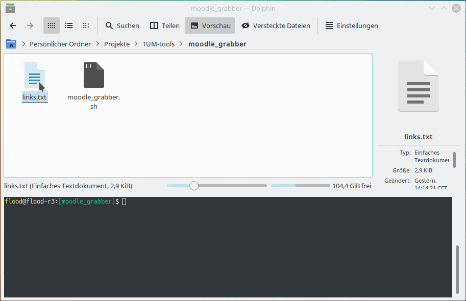

# TUM tools

Some quick 'n dirty tools for TUM students

## dual play

A script that let you run two video files simultanously (slides, video).
Put the lecture recordings in folders called called somthing like `001`, `002`, ...

## nup

Converts slides to 2x2 landscape with a border for the punchers holes.

## mediasite-download-enabler

Enables the download button at TUM mediasite (if disabled by default)

1. Download Greasemonkey (for Firefox) or Tampermonkey (for Chrome)
2. Download mediasite_download_enabler.js from GitHub
3. Edit the settings in the .js-file (e.g. the URL)
4. Navigate to the HTTP- (not HTTPS-) Mediasite and click on the newly created "Create Downloadlinks" button

## mediasite-sync-playback

Helps to playback the slides-video and the camera-recording synchronously using vlc.star

1. Download each lectures video files into a separate folder (like the 001/ one)
2. Start the `./play.sh` script
3. Choose a lecture and select the master video (e.g. the slides)
4. When the video is over, the script will let you move the lecture into one of two directories: `_SEEN` and `_SKIPPED`

## moodle-grabber

Enables you to download a list of files (links.txt) from moodle.tum.de using your console.

1. Make a list of files on moodle -> save as links.txt
2. Make moodle_grabber.sh executable (if not yet): `chmod +x ./moodle_grabber.sh`
3. Run `./moodle_grabber.sh`
4. Enter your credentials
5. Wait till it's finished
