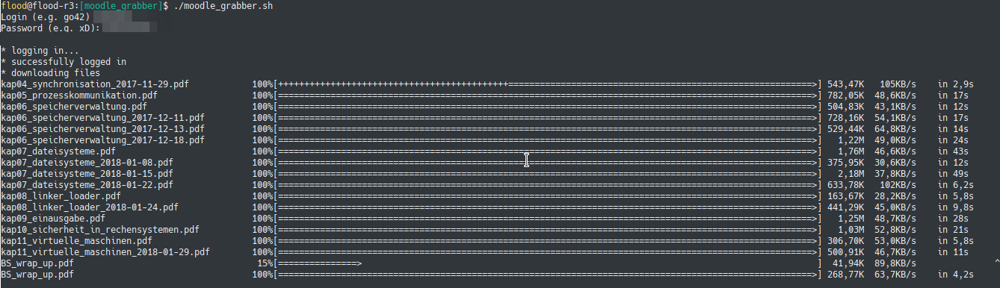

# TUM tools

Some quick 'n dirty tools for TUM students

## mediasite-download-enabler

Enables the download button at TUM mediasite (if disabled by default)

1. Download Greasemonkey (Firefox) or Tampermonkey (Chrome)
2. Download mediasite_download_enabler.js
3. Edit the settings in the .js (e.g. the URL)
4. Navigate to the HTTP (not HTTPS) Mediasite and click on the new "Create Downloadlinks" button

## moodle-grabber

Let you download a list of files (names links.txt) using your console.

1. Make a list of files on moodle -> save as links.txt
2. Make moodle_grabber.sh executable (if not yet): `chmod +x ./moodle_grabber.sh`
3. Run ./moodle_grabber.sh
4. Enter your credentials
5. Wait till it's finished
